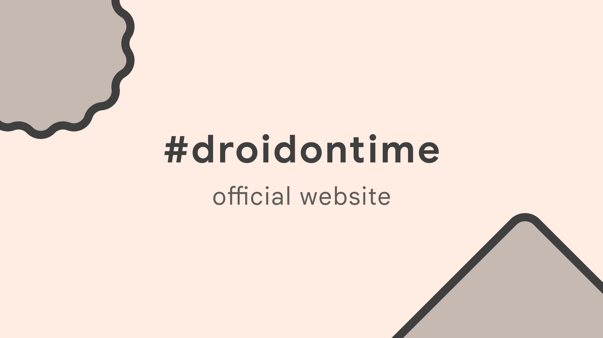

### Structure

```md
- packages/
  - backend/
    - package.json
  - frontend/
    - package.json
- .gitignore
- LICENSE
- package.json
- readme.md
```

### Used technologies

- [Next.js](https://nextjs.org/)
- [TypeScript](https://www.typescriptlang.org/)
- [Express.js](https://expressjs.com/)
- [Tailwind](https://tailwindcss.com/)
- [Yarn](https://yarnpkg.com/)

### Contributing

We will be so happy to see your contribution in our website!
Please keep in mind that all changes should be done on `dev` branch. Default branch (`deploy`) is stable version that is deployed on [droidontime.com](https://www.droidontime.com/).
